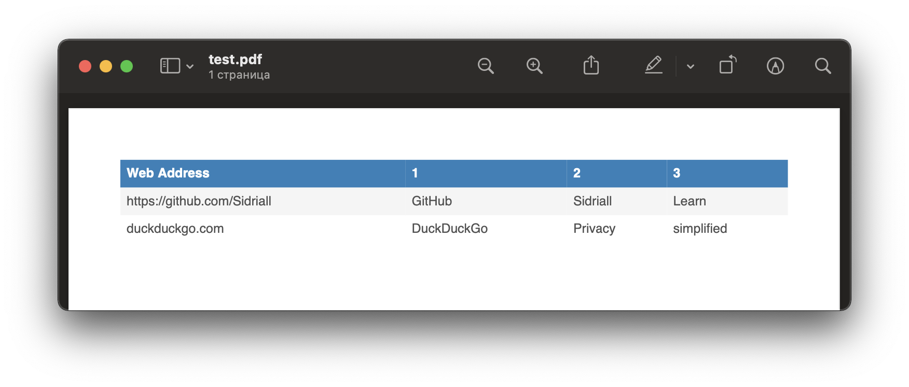

# Web Text Analyzer 🧐
> It is a test project for getting the job offer

## Table of contents
* [General info](#general-info)
* [Screenshot](#screenshot)
* [Main Technologies](#main-technologies)
* [Setup](#setup)
* [Contact](#contact)

## General info
Sending POST request with an array of urls will get you a pdf document with 3 most popular words on the page with length more that four letters.

## Screenshot


## Main Technologies
* @hapi/hapi - version 20.0.3
* joi - version 17.3.0
* textract - version 2.5.0
* jspdf - version 2.3.0

## Setup
1. Clone the repo
   ```sh
   git clone
   ```
2. Install NPM packages
   ```sh
   yarn
   # npm i
   ```

## Contact
Created by [Kirill Chistiakov](https://github.com/Sidriall)
